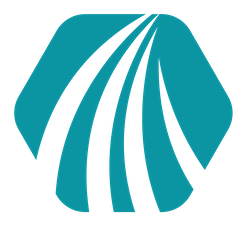

<!-- Improved compatibility of back to top link: See: https://github.com/othneildrew/Best-README-Template/pull/73 -->

<a name="readme-top"></a>

<!--
*** Thanks for checking out the Best-README-Template. If you have a suggestion
*** that would make this better, please fork the repo and create a pull request
*** or simply open an issue with the tag "enhancement".
*** Don't forget to give the project a star!
*** Thanks again! Now go create something AMAZING! :D
-->

<!-- PROJECT SHIELDS -->
<!--
*** I'm using markdown "reference style" links for readability.
*** Reference links are enclosed in brackets [ ] instead of parentheses ( ).
*** See the bottom of this document for the declaration of the reference variables
*** for contributors-url, forks-url, etc. This is an optional, concise syntax you may use.
*** https://www.markdownguide.org/basic-syntax/#reference-style-links
-->

[![LinkedIn][linkedin-shield]][linkedin-url]

<!-- PROJECT LOGO -->
<br />
<div align="center">
  <a href="https://github.com/Abi-Liu/Finance-Me">
    
  </a>

<h3 align="center">FinanceMe</h3>

  <p align="center">
    A full-stack applications where users can log in and connect their bank accounts using the Plaid API's secure connection. The transactional data is then visually presented through graphs as well as a filterable table containing all transaction data.
    <br />
    <a href="https://github.com/Abi-Liu/Finance-Me">View Demo</a>
  </p>
</div>

<!-- TABLE OF CONTENTS -->
<details>
  <summary>Table of Contents</summary>
  <ol>
    <li>
      <a href="#about-the-project">About The Project</a>
      <ul>
        <li><a href="#built-with">Built With</a></li>
      </ul>
    </li>
    <li>
      <a href="#getting-started">Getting Started</a>
      <ul>
        <li><a href="#prerequisites">Prerequisites</a></li>
        <li><a href="#installation">Installation</a></li>
      </ul>
    </li>
    <li><a href="#usage">Usage</a></li>
    <li><a href="#license">License</a></li>
    <li><a href="#contact">Contact</a></li>
    <li><a href="#helpful-resources">Helpful Resources</a></li>
  </ol>
</details>

<!-- ABOUT THE PROJECT -->

## About The Project

<!-- [![Product Name Screen Shot][product-screenshot]](https://example.com) -->

<p align="right">(<a href="#readme-top">back to top</a>)</p>

### Built With

- [![React][react.js]][react-url]
- [![Node][node.js]][node-url]
- [![express][express]][express-url]
- [![mongodb][mongodb]][mongodb-url]
- [![material][material]][material-url]

<p align="right">(<a href="#readme-top">back to top</a>)</p>

<!-- GETTING STARTED -->

## Getting Started

To get a local copy up and running follow these simple example steps.

### Prerequisites

This project requires you to have NPM installed. If you don't, you can do so by entering this command in your terminal

- npm
  ```sh
  npm install npm@latest -g
  ```

### Installation

1. Get a free API Key at [https://dashboard.plaid.com/signup](https://dashboard.plaid.com/signup) and [https://console.cloud.google.com](https://console.cloud.google.com)
2. Clone the repo
   ```sh
   git clone https://github.com/Abi-Liu/Finance-Me.git
   ```
3. Install NPM packages
   ```sh
   npm install
   ```
4. Create a `.env` file in the config folder in the server and link all API keys and MongoDB URI
   ```md
   API_KEY = "ENTER YOUR API"
   DB_STRING = "ENTER YOUR MONGO CONNECTION STRING"
   ```

<p align="right">(<a href="#readme-top">back to top</a>)</p>

<!-- USAGE EXAMPLES -->

## Usage

To use, start the backend by navigating to the server folder and running

```sh
   npm run start
```

Once the server is running, navigate to the client folder and use the command

```sh
   npm run dev
```

Once the servers are up, you can link an account by pressing the button enter the username: user_good and the password: pass_good.
For any 2 factor authentication prompts, you can simply leave it empty and press next. Now that you have linked an account, you should be able to see graphs showing you the spendings per category as well as a table for each transaction.

<p align="right">(<a href="#readme-top">back to top</a>)</p>

<!-- LICENSE -->

## License

Distributed under the MIT License.

<p align="right">(<a href="#readme-top">back to top</a>)</p>

<!-- CONTACT -->

## Contact

Abi Liu - [LinkedIn](https://www.linkedin.com/in/abiliu/) - abiliu018@gmail.com

Project Link: [https://github.com/Abi-Liu/Finance-Me](https://github.com/Abi-Liu/Finance-Me)

<p align="right">(<a href="#readme-top">back to top</a>)</p>

<!-- ACKNOWLEDGMENTS -->

## Helpful Resources

- [Plaid API Documentation](https://plaid.com/docs/api/)
- [Google OAuth Documentation](https://developers.google.com/identity/protocols/oauth2)

<p align="right">(<a href="#readme-top">back to top</a>)</p>

<!-- MARKDOWN LINKS & IMAGES -->
<!-- https://www.markdownguide.org/basic-syntax/#reference-style-links -->

[contributors-shield]: https://img.shields.io/github/contributors/Abi-Liu/Finance-Me.svg?style=for-the-badge
[contributors-url]: https://github.com/Abi-Liu/Finance-Me/graphs/contributors
[forks-shield]: https://img.shields.io/github/forks/Abi-Liu/Finance-Me.svg?style=for-the-badge
[forks-url]: https://github.com/Abi-Liu/Finance-Me/network/members
[stars-shield]: https://img.shields.io/github/stars/Abi-Liu/Finance-Me.svg?style=for-the-badge
[stars-url]: https://github.com/Abi-Liu/Finance-Me/stargazers
[issues-shield]: https://img.shields.io/github/issues/Abi-Liu/Finance-Me.svg?style=for-the-badge
[issues-url]: https://github.com/Abi-Liu/Finance-Me/issues
[license-shield]: https://img.shields.io/github/license/Abi-Liu/Finance-Me.svg?style=for-the-badge
[license-url]: https://github.com/Abi-Liu/Finance-Me/blob/master/LICENSE.txt
[linkedin-shield]: https://img.shields.io/badge/-LinkedIn-black.svg?style=for-the-badge&logo=linkedin&colorB=555
[linkedin-url]: https://linkedin.com/in/abiliu
[product-screenshot]: images/screenshot.png
[react.js]: https://img.shields.io/badge/React-20232A?style=for-the-badge&logo=react&logoColor=61DAFB
[react-url]: https://reactjs.org/
[node.js]: https://img.shields.io/badge/Node.js-43853D?style=for-the-badge&logo=node.js&logoColor=white
[node-url]: https://nodejs.org/en
[express]: https://img.shields.io/badge/Express.js-404D59?style=for-the-badge
[express-url]: https://expressjs.com/
[mongodb]: https://img.shields.io/badge/MongoDB-4EA94B?style=for-the-badge&logo=mongodb&logoColor=white
[mongodb-url]: https://www.mongodb.com/
[material]: https://img.shields.io/badge/Material--UI-0081CB?style=for-the-badge&logo=material-ui&logoColor=white
[material-url]: https://mui.com/
